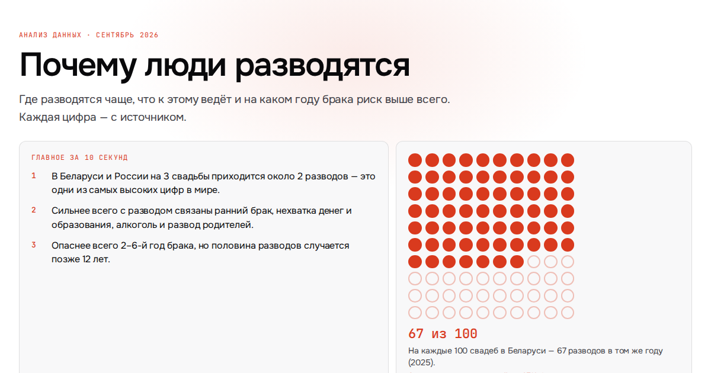

# Почему люди разводятся

Проект по анализу данных: где разводятся чаще, что к этому ведёт и на каком году брака риск выше всего. Для обычного читателя — коротко, наглядно и с источником у каждой цифры.

**Смотреть:** https://rozzhalovetsolga.github.io/divorce-atlas/ · **все данные:** [appendix.html](https://rozzhalovetsolga.github.io/divorce-atlas/appendix.html)



## Вопрос

Почему уровень разводов так различается между странами и людьми, какие причины подтверждаются данными, а какие — мифы.

## Что сделано

- **Данные.** Свежие цифры за 2024–2025 годы по 116 странам и территориям: национальные статслужбы (Белстат, Росстат, ONS, KOSTAT и др.), Eurostat, US Census (ACS 2024), CDC, Всемирный банк, ВОЗ. Беларусь — по областям, США — по всем 50 штатам.
- **Исследования.** Свыше 200 выводов из научных работ с оценкой надёжности: опросы разведённых, долгосрочные исследования, мета-анализы, естественные эксперименты.
- **Расчёты.**
  - риск развода на каждом году брака и суммарный коэффициент разводимости для двух десятков стран Европы (разводы по стажу ÷ браки того года заключения);
  - «из 100 пар»: сколько браков сохранится через 5, 10, 20 и 30 лет;
  - корреляции Спирмена показателей разводов с доходом, образованием, занятостью женщин, алкоголем, религиозностью;
  - частные корреляции по штатам США: связь «евангелисты → разводы» исчезает, если учесть образование.
- **Визуализация.** Картограммы (мир, области Беларуси, штаты США), цепочки причин со сравнениями, калькулятор «сколько лет вы в браке».

## Главные выводы

1. В Беларуси и России на 3 свадьбы приходится около 2 разводов — одни из самых высоких показателей в мире.
2. Сильнее всего с разводом связаны ранний брак, нехватка денег и образования, алкоголь и развод родителей. Из 100 первых браков за 20 лет распадаются 22 у выпускниц вузов и 59 у женщин со школьным образованием.
3. Опаснее всего 2–6-й год брака, но половина разводов случается позже 12 лет.
4. Единственное прямое доказательство причины — смена законов о разводе: реформа даёт всплеск, который примерно за 10 лет рассасывается.
5. «Протестантизм сохраняет брак» — миф: в протестантской Скандинавии разводов больше, чем в католических странах Европы; защищает личная религиозность, а не конфессия страны.

## Ограничения

- «Разводов на 100 свадеб» — не доля распавшихся браков: знаменатель — свадьбы того же года.
- Годы данных по странам разные (последний доступный); страны с данными старше 2015 года на главной карте не раскрашены.
- Большинство связей — корреляции на наблюдательных данных; сила доказательства указана у каждого вывода.
- Для России нет официальных итогов за 2025 год и нет данных о стаже брака при разводе.

## Как устроено

```
index.html, appendix.html, og.png   — готовый сайт (GitHub Pages)
pipeline/
  template_lean.html                — главная страница
  template_map.html                 — приложение со всеми данными
  new_style.css                     — стиль
  build_atlas.py                    — сборка: данные + шаблоны → pipeline/build/
  site_export.py                    — оборачивает сборку в index.html и appendix.html
  analysis_duration.py              — риск развода по стажу брака (Eurostat)
  analysis_correlations.py          — штаты США, показатели стран, религия, корреляции
  check_pages.py                    — превью для соцсетей и проверка на телефоне (playwright)
  fetch_raw.sh                      — обновление сырых выгрузок
  *.json                            — входные данные; у каждой строки есть ссылка на источник
  raw/                              — сырые выгрузки Eurostat, Всемирного банка, ВОЗ, Census, Википедии
```

Пересобрать сайт:

```
cd pipeline
python3 build_atlas.py && python3 site_export.py
```

Обновить данные и расчёты:

```
cd pipeline
./fetch_raw.sh
python3 build_atlas.py && python3 analysis_duration.py && python3 analysis_correlations.py
python3 build_atlas.py && python3 site_export.py && python3 check_pages.py
```

Библиотеки на странице: d3 и topojson-client (CDN). Шрифты: Onest и JetBrains Mono.
